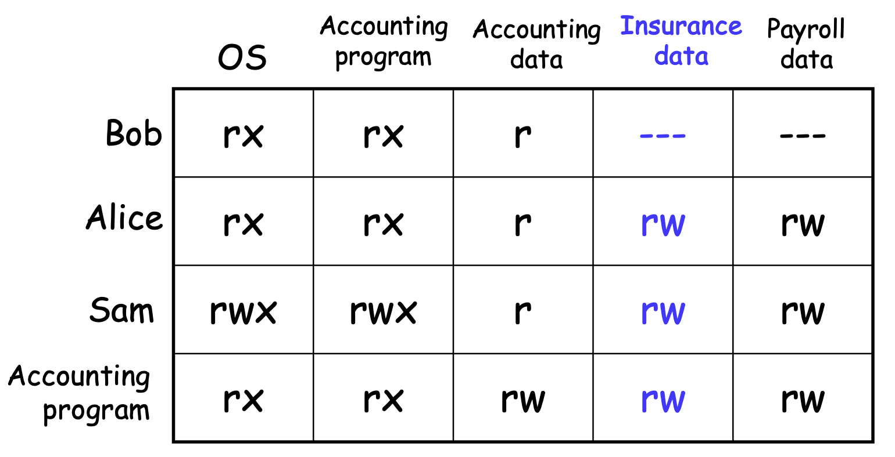
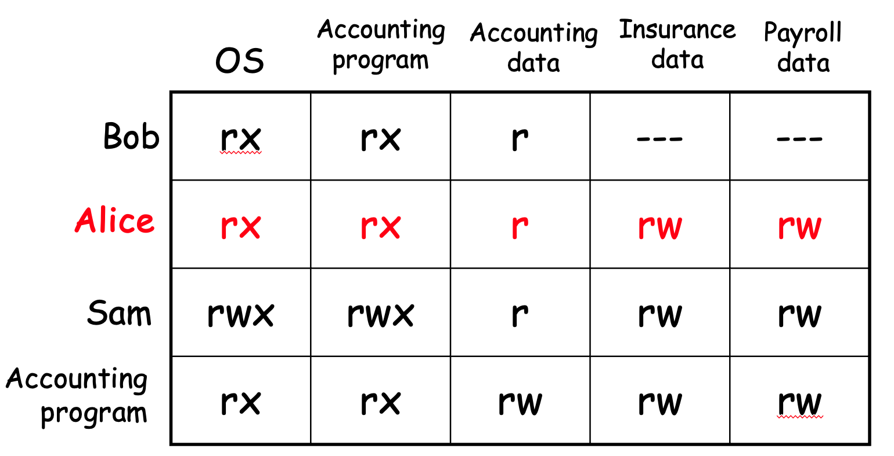
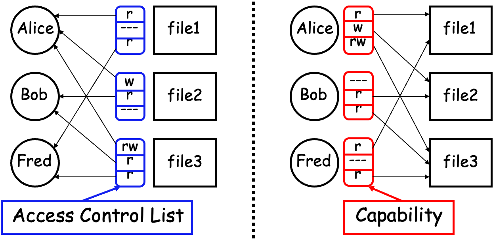
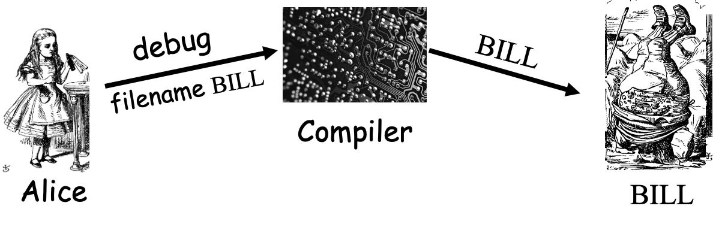
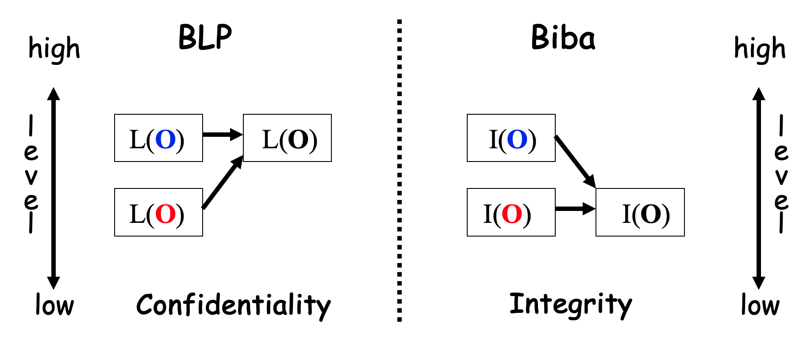
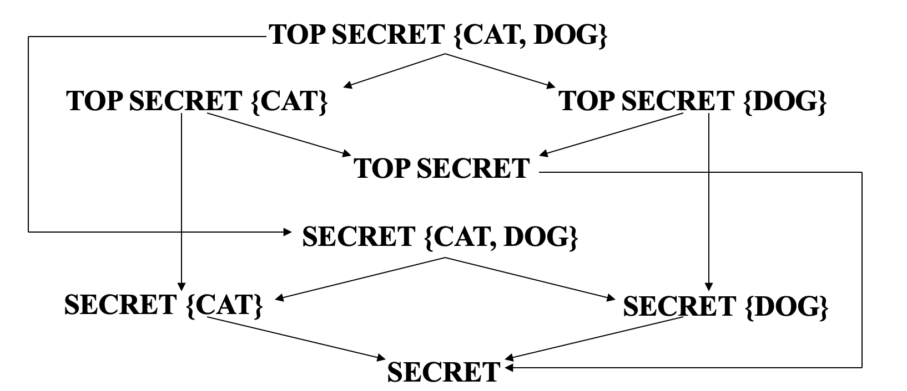
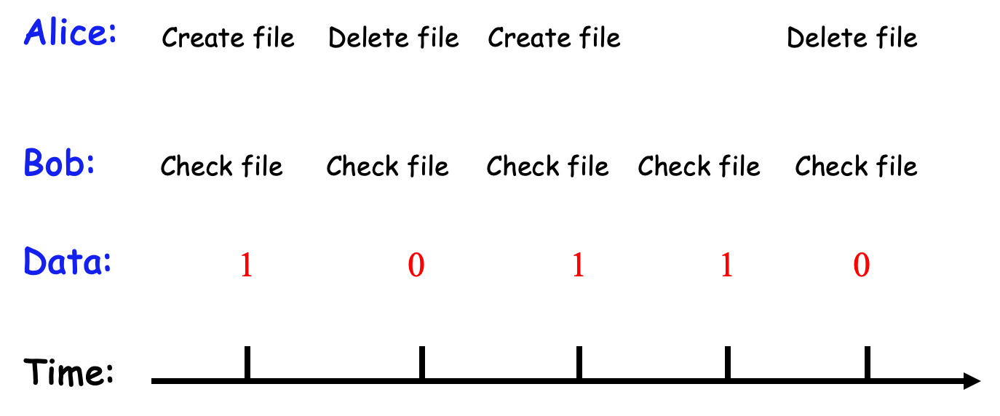
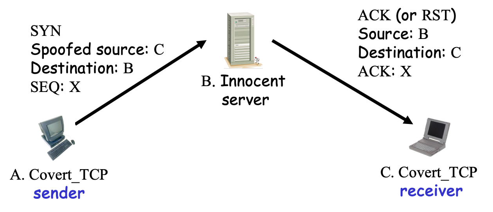

# Lecture 10 

## 7.6 Two-factor Authentication

* Requires any 2 out of 3 of 
  * Something you know
  * Something you have 
  * Something you are 
* Examples
  * ATM: Card and PIN
  * Credit card: Card and signature
  * Password generator: Device and PIN
  * Smartcard with password/PIN

## 7.7 Single Sign-on And Web Cookies

### 7.7.1 Single Sign-on

* A hassle to enter password(s) repeatedly

  重复输入密码很麻烦

  * Alice wants to authenticate only once

    Alice只想验证一次

  * "Credentials" stay with Alice wherever she goes

    无论爱丽丝走到哪里，“凭证”都会跟着她

  * Subsequent authentications transparent to Alice

    后续的身份验证对Alice透明

* Kerberos -- example single sign-on protocol

  Kerberos——单点登录协议示例

* Single sign-on for the Internet?

  互联网的单点登录?

  * Microsoft: **Passport**

    微软:Passport

  * Everybody else: **Liberty Alliance**

    其他所有人:自由联盟

  * Security Assertion Markup Language (**SAML**)

    安全断言标记语言(SAML)

### 7.7.2 Web Cookies

* Cookie is provided by a Website and stored on user's machine
* Cookie indexes a database at Website
* Cookies **maintain state** across sessions
  * Web uses a stateless protocol: HTTP
  * Cookies also maintain state within a session
* Sorta like a single sign-on for a website
  * But, a very, very weak form of authentication
* Cookies also create privacy concerns

# Chapter 8 Authorization

It is easier to exclude harmful passions than to rule them, and to deny them admittance than to control them after they have been admitted. —Seneca 

排除有害的情感要比控制它们容易，拒绝接纳它们要比控制它们容易。塞内加

Wherever there is authority, there is a natural inclination to disobedience.—Thomas Haliburton

哪里有权威，哪里就有自然的不服从倾向。——哈利伯顿

Authentication vs Authorization

认证vs授权

* Authentication -- are you who you say you are?

  身份验证——你是你说的那个人吗?

  *  Restrictions on who (or what) can access system

    限制谁(或什么)可以访问系统

* **Authorization** -- are you allowed to do that?

  **授权**——你可以这样做吗?

  * Restrictions on actions of authenticated users

    经过身份验证的用户的操作限制

* Authorization is a form of access

  授权是一种访问形式

* But first, we look at system certification...

  但首先，我们来看一下系统认证……

**System Certification** 

**体系认证**

* Government attempt to certify "security level" of products 

  政府试图认证产品的“安全等级”

* Of historical interest

  具有历史意义

  * Sorta like a history of authorization

    有点像授权的历史

* Still required today if you want to sell your product to the government

  如果您想将您的产品销售给政府，今天仍然需要

  * Tempting to argue it's a failure since government is so insecure, but ...

    很容易认为这是一个失败，因为政府是如此不安全，但是……

Orange Book

* Trusted Computing System Evaluation Criteria (TCSEC), 1983

  * Universally known as the "orange book"
  * Name is due to color of it's cover 
  * About 115 pages
  * Developed by DoD (NSA)
  * Part of the "ranbow seriers"

* Orange book generated a pseudo-religious fervor among some people

  橙书在一些人中间产生了一种伪宗教狂热

  * Less and less intensity as time goes by

    随着时间的推移，强度越来越小

**Orange Book Outline**

* Goals

  * Provide way to assess security products 

    提供评估安全产品的方法

  * Provide guidance on how to build more secure products

    提供如何构建更安全产品的指导

* Four **divisions** labeled D thru A 

  从D到A的四个**部门**

  * D is lowest, A is highest

    D最小，A最大

* Divisions split into numbered **classes**

  划分为有编号的**类别**

**D and C Division**

* D --- minimal protection

  * Losers that can't get into higher division

    不能进入更高级别的失败者

* C --- discretionary protection, i.e. don't force security on users, have means to detect breaches (audit)

  C——酌情保护，即不强迫用户安全，有方法检测违规(审计)

  * C1 --- discretionary security protection 

     C1——全权安全保护

  * C2 -- controlled access protection

    C2——受控访问保护

  * C2 slightly stronger than C1 (both vague)

    C2比C1稍强(都不明确)

**B Division**

* B --- Mandatory protection 

  B——强制保护

* B is a huge step up from C

  B是C的巨大进步

  * In C, can break security, but get caught

    在C中，可能会破坏安全性，但会被发现

  * In B, "mandatory" means can't break it 

    在B中，“强制”意味着不能打破它

* B1 --- labeled security protection

   B1——标记安全保护

  * All data labeled, which restricts what can be done with it

    所有标记的数据，这限制了可以使用它做什么

  * This access control cannot be violated

    不能违反此访问控制

**B and A division**

* B2 --- structured protection

  B2——结构化保护

  * Adds covert channel protection onto B1

    在B1中添加隐蔽通道保护

* B3 --- security domains

  B3——安全域

  * On top of B2 protection, adds that code must be tamperproof and "small"

    在B2保护的基础上，补充说代码必须是防篡改和“小”的

* A --- verified protection

  A——经过验证的保护

  * Like B3, but proved using formal methods

    像B3，但使用形式化方法证明

  * Such methods still impractical (usually)

    这些方法仍然不切实际(通常)

**Common Criteria**

共同标准

* Successor to the orange book (ca.1998)

  《orange book》的继承者(ca.1998)

  * Due to inflation, move than 1000 pages

    由于篇幅膨胀，移动超过1000页

* An international government standard

  一个国际政府标准

  * And it reads like it...

    它读起来像这样……

  * Won't ever stir same passions as orange book

    永远不会像《橙书》那样激起激情

* CC is relevant in practice, but only if you want to sell to the government

  CC在实践中是相关的，但只有当您想要出售给政府时

* Evaluation Assurance Levels (EALs)

  评估保证等级(EALs)

  * 1 thru 7, from lowest to highest security

    从1到7，安全性从最低到最高

**EAL**

* Note product with high EAL may not be more secure than one with lower EAL
  * Why?
* Also, because product has EAL doesn't mean it's better than the competition
  * Why?

**EAL 1 thru 7**

* EAL1 --- functionally tested 
* EAL2 --- structurally tested
* EAL3 --- methodically tested, checked
* EAL4 --- designed, tested, reviewed
* EAL5 --- semiformally designed, tested
* EAL6 --- verified, designed, tested
* EAL7 --- formally ... (blah blah blah)

**Common Criteria**

通用标准

* EAL4 is most commonly sought

   EAL4是最常用的

  * Minimum needed to sell to government

    卖给政府的最低要求

* EAL7 requires formal proofs

  EAL7要求正式证明

  * Author could only find 2 such products...

    作者只能找到2个这样的产品…

* Who performs evaluations?

  谁执行评估?

  * Government accredited labs, of course

    当然是政府认可的实验室

  * For a hefty fee (like, at least 6 figures)

    高额费用(至少6位数)

**Authentication vs Authorization**

* Authentication -- Are you who you say you are? 

  身份验证——你是你说的那个人吗?

  * Restrictions on who (or what) can access system 

    限制谁(或什么)可以访问系统

* Authorization -- Are you allowed to do that?

  授权——你可以这样做吗?

  * Restrictions on actions of authenticated users

    经过身份验证的用户的操作限制

* Authorization is a form of access control 

  授权是一种访问控制形式

* Classic authorization enforced by 

  强制执行的经典授权

  * Access Control Lists (ACLs)

    访问控制列表(acl)

  * Capabilities (C-lists)

    功能(C-lists)

**Lampson’s Access Control Matrix**

* **Subjects** (users) index the rows
* **Objects** (resources) index the columns 

**Are You Allowed to Do That?** 

* **Access control matrix** has **all** relevant info
* Could be 1000’s of users, 1000’s of resources
* Then matrix with 1,000,000’s of entries
* How to manage such a large matrix?
* Need to check this matrix before access to any resource is allowed
* How to make this efficient?

**Access Control Lists (ACLs)**

* ACL: store access control matrix by **column**
* Example: ACL for **insurance data** is in **blue**

**Capabilities (or C-Lists)**

* Store access control matrix by **row**

* Example: Capability for **Alice** is in **red**

**ACLs vs Capabilities**

* Note that arrows point in opposite directions…

* With ACLs, still need to associate users to files

**Confused Deputy**

* Two resources

  两个资源

* Compiler and BILL file (billing info

  编译器和账单文件(账单信息

* Compiler can write file BILL

  编译器可以编写文件账单

* Alice can invoke compiler with a debug filename

  Alice可以使用调试文件名调用编译器

* Alice not allowed to write to BILL

  不允许爱丽丝给比尔写信

* Access control matrix 

  访问控制矩阵

**ACL’s and Confused Deputy**

* Compiler is **deputy** acting on behalf of Alice

  编译器是Alice的**代理**

* Compiler is **confused**

  编译器是**困惑的**

* Alice is not allowed to write BILL

  艾丽丝不允许给比尔写信

* Compiler has confused its rights with Alice’s

  编译器混淆了它和Alice的权限

**Confused Deputy**

* Compiler acting for Alice is confused

  代理Alice的编译器很困惑

* There has been a separation of **authority** from the **purpose** for which it is used

  存在**权限**与其使用的**目的**的分离

* With ACLs, difficult to avoid this problem

  使用acl，很难避免这个问题

* With Capabilities, easier to prevent problem

  有了功能，更容易预防问题

  * Must maintain association between authority and intended purpose

    必须保持权威和预期目的之间的关联

  * Capabilities make it easy to **delegate** authority

    功能使**授权**变得容易

**ACLs vs Capabilities**

* ACLs

  * Good when users manage their own files

    适合用户管理自己的文件

  * Protection is data-oriented

    保护是面向数据的

  * Easy to change rights to a resource

    易于更改资源的权限

* Capabilities

  * Easy to delegate---avoid the [confused deputy](http://www.cis.upenn.edu/~KeyKOS/ConfusedDeputy.html)

    易于委派——避免[困惑的副手](http://www.cis.upenn.edu/~KeyKOS/ConfusedDeputy.html)

  * Easy to add/delete users

    易于添加/删除用户

  * More difficult to implement

    更难实现

  * The “Zen of information security”

    “信息安全之禅”

* Capabilities loved by academics 

  受到学者喜爱的能力

  * [Capability Myths Demolished](http://www.erights.org/elib/capability/duals/myths.html)

    [消除能力神话](http://www.erights.org/elib/capability/duals/myths.html)

**Multilevel Security (MLS) Models**

**Classifications and Clearances**

**分类和许可**

* **Classifications** apply to **objects**

  **分类**适用于**对象**

* **Clearances** apply to **subjects**

  **许可**适用于**科目**

* US Department of Defense (DoD) uses 4 levels:

  美国国防部(DoD)使用4个级别:

  **TOP SECRET**  **绝密的**

  **SECRET** 秘密

  **CONFIDENTIAL **机密

  **UNCLASSIFIED** 不保密

**Clearances and Classification**

* To obtain a **SECRET** clearance requires a routine background check

  为了获得秘密许可，需要例行的背景调查

* A **TOP SECRET** clearance requires extensive background check

  最高机密的许可需要广泛的背景调查

* Practical classification problems

  实际分类问题

  * Proper classification not always clear

    正确的分类并不总是清晰的

  * Level of granularity to apply classifications

    应用分类的粒度级别

  * Aggregation -- flipside of granularity

    聚合--粒度的另一面

**Subjects and Objects**

**主体和客体**

* Let O be an **object**, S a **subject**

  设O是**宾语**，是**主语**

  * O has a classification

    O有一个分类

  * S has a clearance

    S有权限

  * Security **level** denoted L(O) and L(S)

    安全**级别**，用L(O)和L(S)表示

* For DoD levels, we have

  对于DoD级别，我们有

  **TOP** **SECRET** > **SECRET** > **CONFIDENTIAL** > **UNCLASSIFIED**

  

**Multilevel Security (MLS)**

* MLS needed when subjects/objects at different levels use/on **same system**

  不同级别的主体/对象在**同一系统**上使用时需要MLS

* MLS is a form of **Access Control**

   MLS是**访问控制**的一种形式

* Military and government interest in MLS for many decades 

  军方和政府对MLS的兴趣已有几十年了

  * Lots of research into MLS

    对MLS进行了大量研究

  * Strengths and weaknesses of MLS well understood (almost entirely theoretical)

    充分理解MLS的优缺点(几乎完全是理论性的)

  * Many possible uses of MLS outside military

    MLS在军事以外的许多可能用途

**MLS Applications**

* Classified government/military systems

  机密的政府/军事系统

* **Business example:** info restricted to

  **商业例子:**信息限制为

  * Senior management only, all management, everyone in company, or general public

    仅限高级管理层、所有管理层、公司所有人或普通公众

* Network firewall

  网络防火墙

* Confidential medical info, databases, etc.

  机密医疗信息、数据库等

* Usually, MLS not a viable technical system

  通常，MLS不是一个可行的技术系统

  * More of a legal device than technical system

    更多的是一个法律装置而不是技术系统

**MLS Security Models**

* MLS models explain **what** needs to be done

  MLS模型解释了需要做**什么**

* Models **do not** tell you **how** to implement

  模型**不会**告诉你**如何**实现

* Models are descriptive, not prescriptive

  模型是描述性的，而不是规范性的

  * That is, high level description, not an algorithm

    这是高级描述，而不是算法

* There are many MLS models 

  有很多MLS模型

* We’ll discuss simplest MLS model

  我们将讨论最简单的MLS模型

  * Other models are more realistic

    其他模型更真实

  * Other models also more complex, more difficult to enforce, harder to verify, etc.

    其他模型也更复杂，更难执行，更难验证等。

**Bell-LaPadula**

* BLP security model designed to express essential requirements for MLS

  设计用于表达MLS基本需求的BLP安全模型

* BLP deals with **confidentiality**

  BLP处理**机密性**

  * To prevent unauthorized reading

    防止未经授权的读取

* Recall that O is an object, S a subject

  回想一下，O是宾语，S是主语

  * Object O has a classification

    对象O有一个分类

  * Subject S has a clearance

    受试者S已获得许可

  * Security level denoted L(O) and L(S)

    安全级别表示为L(O)和L(S)

* BLP consists of

  **Simple Security Condition**: S can read O if and only if $L(O) \leq L(S)$

  ***-Property** (**Star Property**): S can write O if and only if $L(S) \leq L(O)$

* **No read up, no write down**

**McLean’s Criticisms of BLP**

**McLean对BLP的批评**

* McLean: BLP is “so trivial that it is hard to imagine a realistic security model for which it does not hold”

  McLean: BLP是“如此微不足道，以至于很难想象一个现实的安全模型不适用”

* McLean’s “system Z” allowed administrator to reclassify object, then “write down”

  McLean的“system Z”允许管理员对对象重新分类，然后“写下”

* Is this fair? 

  这公平吗?

* Violates spirit of BLP, but **not** expressly forbidden in statement of BLP

  违反了BLP的精神，但BLP声明中**没有**明文禁止

* Raises fundamental questions about the nature of (and limits of) modeling

  提出了关于建模的本质(和限制)的基本问题

**B and LP’s Response**

* BLP enhanced with **tranquility property**

  使用**宁静属性**增强BLP

  * Strong tranquility: security labels never change

    强大的稳定性:安全标签从未改变

  * Weak tranquility: security label can only change if it does not violate “established security policy”

    弱安宁:只有在不违反“已建立的安全策略”的情况下，安全标签才能更改

* Strong tranquility impractical in real world

  现实世界中强烈的宁静不切实际

  * Often want to enforce “least privilege”

    经常想要强制执行“最小特权”

  * Give users lowest privilege for current work

    为用户当前工作提供最低权限

  * Then upgrade as needed (and allowed by policy)

    然后根据需要(并允许策略)进行升级

  * This is known as the **high water mark** principle

    这被称为**高水位**原则

* Weak tranquility allows for **least privilege** (high water mark), but the property is vague

   Weak serenity允许**最小特权**(高水位标记)，但其属性是模糊的

**BLP: The Bottom Line**

* BLP is simple, probably too simple

  BLP很简单，可能太简单了

* BLP is one of the few security models that can be used to prove things about systems

   BLP是少数几个可以用来证明系统的安全模型之一

* BLP has inspired other security models

  BLP启发了其他安全模型

  * Most other models try to be more realistic

    大多数其他模型试图更真实

  * Other security models are more complex

    其他安全模型更复杂

  * Models difficult to analyze, apply in practice

    难以分析的模型，在实践中应用

**Biba’s Model**

* BLP for confidentiality, Biba for **integrity**

   BLP用于保密性，Biba用于**完整性**

  * Biba is to prevent unauthorized writing

    Biba用于防止未经授权的写作

* Biba is (in a sense) the dual of BLP

  Biba(在某种意义上)是BLP的对偶

* Integrity model

  完整性模型

  * Spse you trust the integrity of **O** but not **O** 

    Spse您信任**O**，而不信任**O**

  * If object **O** includes **O** and **O**  then you cannot trust the integrity of **O**

    如果对象**O**包含**O**和**O**，那么你不能相信**O**的完整性

* Integrity level of O is minimum of the integrity of any object in O

   O的完整性级别是O中任何对象的完整性的最小值

* **Low water mark** principle for integrity

  **低水位线**完整性原则

**Biba**

* Let I(O) denote the integrity of object O and I(S) denote the integrity of subject S

  设I(O)表示客体O的完整性，I(S)表示主体S的完整性

* Biba can be stated as

  Biba可以表述为

  **Write Access Rule:** S can write O if and only if $I(O) \leq I(S)$  

  **写访问规则:** S可以写O当且仅当 $I(O) \leq I(S)$

  (if S writes O, the integrity of O $\leq$ that of S)

  (如果S写O, O的完整性$\leq$ S的完整性)

  **Biba’s** **Model:** S can read O if and only if  $I(S)\leq I(O)$  

  **Biba的** **模型:** S可以读取O当且仅当  $I(S)\leq I(O)$

  (if S reads O, the integrity of S $\leq$ that of O)

  (如果S读O, S的完整性$\leq$ O的完整性)

* Often, replace Biba’s Model with

  通常，将Biba的模型替换为

  **Low Water Mark Policy:** If S reads O, then  I(S) = min(I(S), I(O))

   **低水位线策略:**如果S读取O，那么I(S) = min(I(S)， I(O))

**BLP vs Biba**

**Compartments**

**隔间**

**Compartments**

* Multilevel Security (MLS) enforces access control **up and down** 

  多级安全(MLS)强制**上下**访问控制

* Simple hierarchy of security labels is generally *not* flexible enough

  简单的安全标签层次结构通常不够灵活

* Compartments enforces restrictions **across**

  分区强制**跨**限制

* Suppose **TOP SECRET** divided into **TOP SECRET {CAT}** and **TOP SECRET {DOG}** 

  假设**最高机密**分为**最高机密{猫}**和**最高机密{狗}**

* Both are **TOP SECRET** but information flow restricted across the **TOP SECRET** level

  两者都是**绝密**，但在**绝密**级别上信息流受到限制

* Why compartments?

  为什么要用隔间?

  * Why not create a new classification level?

    为什么不创建一个新的分类级别?

* May not want either of

  可能两个都不想要

  * **TOP SECRET {CAT}** $\geq$**TOP SECRET {DOG}**

    **最高机密{猫}** $\geq$ **最高机密{狗}**

  * **TOP SECRET {DOG}** $\geq$ **TOP SECRET {CAT}**

    **最高机密{狗}** $\geq$ **最高机密{猫}**

* Compartments designed to enforce the **need to know** principle

  划分的目的是强制执行**必知**原则

  * Regardless of clearance, you only have access to info that you need to know to do your job

    无论权限如何，你只能获得你工作中需要知道的信息

* Arrows indicate “$\geq$” relationship

  箭头表示“$\geq$”关系

  

* Not all classifications are comparable, e.g., **TOP SECRET {CAT}** vs **SECRET {CAT, DOG}**

  并不是所有的分类都是可以比较的，例如**绝密{猫}**和**机密{猫，狗}**

**MLS vs Compartments**

* MLS can be used without compartments

  MLS可以在没有隔间的情况下使用

  * And vice-versa

    反之亦然

* But, MLS almost always uses compartments

  但是，MLS几乎总是使用分隔符

* Example 

  * MLS mandated for protecting medical records of British Medical Association (BMA)

    MLS授权保护英国医学会(BMA)的医疗记录

  * AIDS was **TOP SECRET**, prescriptions **SECRET**

    艾滋病是**最高机密**，处方是**机密**

  * What is the classification of an AIDS drug?

    艾滋病药物的分类是什么?

  * Everything tends toward **TOP SECRET**

    一切都倾向于**绝密**

  * Defeats the purpose of the system!

    破坏了系统的功能!

* Compartments-only approach used instead

  使用仅分隔的方法

**Covert Channel**

**Covert Channel**

* MLS designed to restrict legitimate channels of communication

  旨在限制合法通信通道的MLS

* May be other ways for information to flow

  可能是信息流动的其他方式

* For example, resources shared at different levels could be used to “signal” information

  例如，在不同级别共享的资源可以用于“信号”信息

* **Covert channel**: a communication path not intended as such by system’s designers

  **隐蔽通道**:系统设计者并非有意为之的通信路径

**Covert Channel Example**

* Alice has **TOP SECRET** clearance, Bob has **CONFIDENTIAL** clearance

  Alice拥有**绝密**权限，Bob拥有**机密**权限

* Suppose the file space shared by all users

  假设文件空间由所有用户共享

* Alice creates file FileXYzW to signal “1” to Bob, and removes file to signal “0”

  Alice创建文件FileXYzW以向Bob发送信号“1”，并删除文件以发送信号“0”

* Once per minute Bob lists the files

  Bob每分钟列出一次文件

  * If file FileXYzW does not exist, Alice sent 0

    如果文件FileXYzW不存在，Alice发送0

  * If file FileXYzW exists, Alice sent 1

    如果文件FileXYzW存在，Alice发送1

* Alice can leak **TOP SECRET** info to Bob!

  Alice可以将**绝密**信息泄露给Bob!

**Covert Channel**

秘密通道

* Other possible covert channels?

  其他可能的隐蔽通道?

  * Print queue

    打印队列

  * ACK messages

    ACK消息

  * Network traffic, etc.

    网络流量等

* When does covert channel exist?

  什么时候存在隐蔽通道?

  1. Sender and receiver have a shared resource

     发送方和接收方共享资源

  2. Sender able to vary some property of resource that receiver can observe

     发送方可以改变接收方可以观察到的资源的某些属性

  3. “Communication” between sender and receiver can be synchronized

     发送方和接收方之间的“通信”可以同步

* So, covert channels are everywhere

  因此，隐蔽通道无处不在

* “Easy” to eliminate covert channels:

  “容易”消除隐蔽通道:

  * Eliminate all shared resources…

    消除所有共享资源…

  * …and all communication

    和所有的沟通

* Virtually impossible to eliminate covert channels in any useful system

  在任何有用的系统中几乎不可能消除隐蔽通道

  * DoD guidelines: **reduce covert channel capacity** to no more than 1 bit/second

    DoD指南:**减少隐蔽信道容量**到不超过1比特/秒

  * Implication? DoD has given up on *eliminating* covert channels!

    含义?国防部已经放弃了**消除**隐蔽通道!

* Consider 100MB **TOP SECRET** file

  考虑100MB的**绝密**文件

  * Plaintext stored in **TOP SECRET** location

    明文存储在**绝密**位置

  * Ciphertext (encrypted with AES using 256-bit key) stored in **UNCLASSIFIED** location

    存储在**未加密**位置的密文(使用256位密钥使用AES加密)

* Suppose we reduce covert channel capacity to 1 bit per second

  假设我们将隐蔽信道容量降低到每秒1比特

* It would take more than 25 years to leak entire document thru a covert channel

  通过隐蔽通道泄露整个文件需要超过25年的时间

* But it would take less than 5 minutes to leak 256-bit AES key thru covert channel!

  但是通过隐蔽通道泄露256位AES密钥只需要不到5分钟!

**Real-World Covert Channel**

* Hide data in TCP header “reserved” field 

  在TCP首部“reserved”字段中隐藏数据

* Or use covert_TCP, tool to hide data in

  或者使用covert_TCP工具隐藏数据

  * Sequence number

    序列号

  * ACK number

    ACK编号

* Hide data in TCP sequence numbers

  以TCP序列号隐藏数据

* Tool: covert_TCP

  工具:covert_TCP

* Sequence number X contains covert info

  序列号X包含隐蔽信息

  

**Inference Control**

**Inference Control Example**

**推理控制示例**

* Suppose we query a database

  假设我们要查询数据库

  * Question: What is average salary of female CS professors at SJSU?

    问题:中山大学计算机系女教授的平均工资是多少?

  * Answer: $95,000

    答案:95000美元

  * Question: How many female CS professors at SJSU?

    问题:SJSU有多少女CS教授?

  * Answer: 1

    答案:1

* Specific information has leaked from responses to general questions

  对一般问题的回答泄露了具体信息

**Inference Control and Research**

**推理控制和研究**

* For example, medical records are private but valuable for research

  例如，医疗记录是私人的，但有研究价值

* How to make info available for research and protect privacy?

  如何为研究提供信息并保护隐私?

* How to allow access to such data without leaking specific information?

  如何在不泄露特定信息的情况下访问这些数据?

**Naïve Inference Control**

**Naïve推理控制**

* Remove names from medical records?

  从病历中删除名字?

* Still may be easy to get specific info from such “anonymous” data

  从这种“匿名”数据中仍然可以很容易地获得特定信息

* Removing names is not enough

  删除名字是不够的

  * As seen in previous example

    如前面的例子所示

* What more can be done?

  还可以做什么?

**Less-naïve Inference Control**

**Less-naïve推理控制**

* Query set size control

  控制查询集的大小

  * Don’t return an answer if set size is too small

    如果set的大小太小，不要返回答案

* N-respondent, k% dominance rule

  n -受访者，k%占优规则

  * Do not release statistic if k% or more contributed by N or fewer

    如果k%或更多由N或更少贡献，则不要发布统计数据

  * Example: Avg salary in Bill Gates’ neighborhood

    例如:比尔·盖茨家附近的平均工资

  * This approach used by US Census Bureau

    美国人口普查局使用的方法

* Randomization

  随机化

  * Add small amount of random noise to data

    向数据中添加少量的随机噪声

* Many other methods -- none satisfactory

  许多其他方法--都不令人满意

**Inference Control**

**推理控制**

* Robust inference control may be impossible

  健壮的推理控制可能是不可能的

* Is weak inference control better than nothing?

  弱的推理控制总比没有要好吗?

  * **Yes**: Reduces amount of information that leaks

     **是**:减少泄漏的信息数量

* Is weak covert channel protection better than nothing?

  弱的隐蔽通道保护总比没有要好吗?

  * **Yes**: Reduces amount of information that leaks

    **是**:减少泄漏的信息数量

* Is weak crypto better than no crypto?

  弱加密比没有加密更好吗?

  * **Probably not:** Encryption indicates important data

    **可能不会:**加密表明数据很重要

  * May be easier to filter encrypted data

    可能更容易过滤加密数据

**CAPTCHA**

**Turing Test**

* Proposed by Alan Turing in 1950

  由Alan Turing在1950年提出

* Human asks questions to another human and a computer, without seeing either

  人类向另一个人类和一台计算机提问，但没有看到任何一个人

* If questioner cannot distinguish human from computer, computer passes the test

  如果提问者不能区分人与计算机，则计算机通过测试

* The **gold standard** in artificial intelligence

  人工智能的**金标准**

* No computer can pass this today

  现在没有电脑能通过这个

  * But some claim to be [close to passing](http://www.telegraph.co.uk/earth/main.jhtml?xml=/earth/2008/10/12/eacomputer112.xml)

    但有些人声称[接近及格](http://www.telegraph.co.uk/earth/main.jhtml?xml=/earth/2008/10/12/eacomputer112.xml)

**CAPTCHA**

* **CAPTCHA** 

  **验证码**

  * **C**ompletely **A**utomated **P**ublic **T**uring test to tell **C**omputers and **H**umans **A**part

    完全是一种**自动化**测试，用于告诉**C**计算机和**H**人类**是**一部分

* **A**utomated-- test is generated and scored by a computer program

   自动化的--测试由计算机程序生成并评分

* **P**ublic--program and data are public

  公共--程序和数据是公共的

* **T**uring test to tell… -- humans can pass the test, but machines cannot pass

  有测试表明……四分之三的人类可以通过测试，但机器无法通过

  * Also known as **HIP** == **H**uman **I**nteractive **P**roof

    也称为HIP == 人类交互证明

* Like an inverse Turing test (well, sort of…)

  类似于逆向图灵测试(嗯，有点…)

**CAPTCHA Paradox?**

**验证码悖论?**

* “…CAPTCHA is a program that can generate and grade tests that it itself cannot pass…”

  “……CAPTCHA是一个程序，它可以生成和评分它自己无法通过的测试……”

  * “…much like some professors…”

    “很像一些教授……”

* Paradox -- computer creates and scores test that it cannot pass!

  悖论——计算机创造了它无法通过的考试并给出了分数!

* CAPTCHA used so that only humans can get access (i.e., no bots/computers)

  使用验证码，以便只有人类才能访问(即没有机器人/计算机)

* CAPTCHA is for **access control**

  CAPTCHA用于**访问控制**

**CAPTCHA Uses?**

**验证码使用吗?**

* Original motivation: automated bots stuffed ballot box in vote for best CS grad school

  最初的动机:自动机器人在投票箱中为最佳CS研究生院投票

  * SJSU vs Stanford?

     SJSU vs Stanford?

* Free email services -- spammers like to use bots to sign up for 1000’s of email accounts

  免费电子邮件服务--垃圾邮件发送者喜欢使用机器人注册1000个电子邮件账户

  * CAPTCHA employed so only humans get accounts

    使用验证码，只有人类才能获得账户

* Sites that do not want to be automatically indexed by search engines

  不希望被搜索引擎自动索引的网站

  * CAPTCHA would force human intervention

    验证码将强制人工干预

**CAPTCHA: Rules of the Game**

**CAPTCHA:游戏规则**

* Easy for most humans to pass

  对大多数人来说很容易通过

* Difficult or impossible for machines to pass

  机器很难或不可能通过

  * **Even with access to CAPTCHA software**

     **甚至可以使用CAPTCHA软件**

* From Trudy’s perspective, the only unknown is a random number

  从Trudy的角度来看，唯一的未知是一个随机数

  * Analogous to Kerckhoffs’ Principle

    类似于Kerckhoffs的原理

* Desirable to have different CAPTCHAs in case some person cannot pass one type

  希望有不同的验证码，以防某些人无法通过一种类型的验证码

  * Blind person could not pass visual test, etc.

    盲人无法通过视觉测试等。

**Do CAPTCHAs Exist?**

* Test: Find 2 words in the following

  

* Easy for most humans

  对大多数人来说很容易

* A (difficult?) OCR problem for computer

   A(难?)计算机的OCR问题

  * OCR == Optical Character Recognition

    OCR ==光学字符识别

**CAPTCHAs**

**验证码**

* Current types of CAPTCHAs

  当前验证码的类型

  * Visual -- like previous example

    视觉--与之前的例子类似

  * Audio -- distorted words or music

  * 音频--扭曲的单词或音乐

* No text-based CAPTCHAs

  没有基于文本的验证码

  * Maybe this is impossible…

    也许这是不可能的……

**CAPTCHA’s and AI**

**验证码和AI**

* OCR is a challenging AI problem

  OCR是一个具有挑战性的AI问题

  * Hard part is the **segmentation problem**

    困难的部分是**分割问题**

  * Humans good at solving this problem 

    人类擅长解决这个问题

* Distorted sound makes good CAPTCHA

  扭曲的声音是很好的验证码

  * Humans also good at solving this

    人类也擅长解决这个问题

* Hackers who break CAPTCHA have solved a hard AI problem

  破解验证码的黑客解决了一个AI难题

  * So, putting hacker’s effort to good use!

    所以，好好利用hacker的努力吧!

* Other ways to defeat CAPTCHAs???

  其他击败验证码的方法??